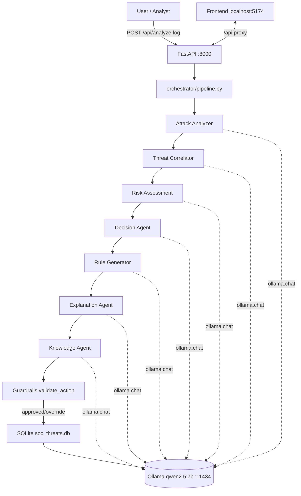

# PASR Autonomous SOC — Implementation Status Report

**Document type:** Technical Status / Maturity Report
**Repo:** `PASR-Autonomous-SOC` (local, `C:\Users\abdok\PASR-Autonomous-SOC`)
**Date of inspection:** 2026-09-01
**Status legend used throughout:**
| Marker | Meaning |
|---|---|
| ✅ **IMPLEMENTED** | Working, exercised end-to-end, verified live |
| 🟡 **PARTIALLY IMPLEMENTED** | Code present but limited vs. architecture-book intent |
| ⏳ **PLANNED** | Described in the Architecture Book, not started |
| ❌ **NOT IMPLEMENTED** | Absent |
| 🔮 **FUTURE** | Out of scope / explicitly deferred |

> **Methodology note.** The **Architecture Book v2.0** (`PASR_Architecture_Book.md` in Downloads/Documents) is the *design spec*. This report **never conflates** what the book *plans* with what the repo *currently does*. Every claim below is marked IMPLEMENTED / PARTIALLY / PLANNED / NOT / FUTURE and backed by inspected source files, live running services, and real database rows. Architecture-book design is always tagged `PLANNED` unless the code demonstrably implements it.

---

## 0. Executive Summary

PASR is a **self-defending web platform** specified in the Architecture Book v2.0 as a closed OODA control loop (Observe → Orient → Decide → Act → Validate → Feedback). The current repo implements a **working autonomous SOC decision pipeline** (`soc-ai-engine`) and a **live React dashboard** (`fullstack-dashboard`), both proven running at the time of inspection.

**What is real and verified:**
- A **7-agent AI pipeline + guardrail gate + persistence** (`orchestrator/pipeline.py`) drives end-to-end log → analysis → decision → rule → explanation → knowledge flow, backed by local **Ollama `qwen2.5:7b`**.
- A **FastAPI backend** (`:8000`) exposing both legacy (`/analyze-log`, `/incidents`) and namespaced (`/api/*`) REST endpoints, plus live infrastructure health checks against SQLite and Ollama.
- A **React + Vite frontend** (`localhost:5174`) with five working views (Dashboard, Incidents, Response Actions, AI Agents, Infrastructure), a Vite `/api` proxy, and live polling/notification.
- **Real data:** `soc_threats.db` holds **33 incidents** and **26 simulated actions**; health endpoint reports *healthy / operational / online / active*; all three services (backend:8000, frontend:5174, Ollama:11434) were confirmed listening at inspection.

**The dominant gap:** the Architecture Book describes a *distributed, containerized, Zero-Trust platform* (reverse proxy + SOC engine + pentest engine + PostgreSQL + Redis, WebSockets, auth/RBAC, Sigma rules, self-pentesting). The repo implements the **AI/Backend decisions + Dashboard slice** of that vision. The **Pentest engine, live reverse-proxy rule enforcement (FR4), auto-apply/rollback (M8), SOC high-volume log pipeline (FR1/FR2 full form), PostgreSQL/Redis, WebSockets, and authentication are NOT implemented.** Rule "application" is currently **simulated/logged only** (never touches a proxy).

The project is best characterized as **AI layer (M7) largely done, Runtime closed loop (M8) partially simulated, and M2/M3/M4/M5 in lightweight local form** — an excellent demonstrable vertical slice, not yet the platform described in the book.

---

## 1. Architecture Book Vision (PLANNED / reference only)

The source of truth for the planned design. **Full book read** at `Downloads\PASR_Architecture_Book.md` (v2.0, 21 sections, 930 lines).

**OODA loop mapped in the book** (Section 1, 2, 5):
`Observe (Reverse Proxy/Log pipeline) → Orient (SOC detection/threat intel) → Decide (AI multi-agent → Decision Engine guardrails) → Act (Runtime Configuration applies rules) → Validate (Pentest engine re-attacks) → Feedback (back to SOC for learning)`.

**Planned architecture layers** (Section 2):
`Internet → ReverseProxy/WAF → Log Pipeline → SOC Detection → Threat Intel → AI Multi-Agent → Decision Engine → Runtime Config → Dashboard → Database → Pentest Engine → Validation → Feedback`.

**Functional Requirements (FR1–FR7):**
- **FR1** Proxy must log and optionally mirror all traffic.
- **FR2** SOC engine parses, detects, scores, alerts.
- **FR3** AI agents triage, correlate, decide, explain.
- **FR4** Runtime engine applies/rolls back proxy rules from AI decisions.
- **FR5** Pentest engine validates mitigations against the same vector.
- **FR6** Dashboard shows live alerts, timeline, health, overrides.
- **FR7** All actions auditable.

**Non-Functional Requirements (NFR1–NFR6):** performance (NFR1 <15ms p95 proxy overhead), scalability (NFR2), availability/fail-open (NFR3), Zero Trust (NFR4), immutable audit (NFR5), explainable AI (NFR6).

> These are the **target**. Mapping to current status appears throughout this document and in the RTM (Section 20).

---

## 2. High-Level Architecture — Planned vs. Implemented

**Planned (Architecture Book §2):**
`Internet → ReverseProxy/WAF → Log Pipeline (Vector/Filebeat→Kafka/Redis Streams) → SOC Engine → Threat Intel → AI Multi-Agent → Decision Engine → Runtime Config → Proxy/Back → Dashboard + PostgreSQL/Redis`.

**Implemented (actual repo):**
```
Raw log line (HTTP POST)
      │
      ▼
[FastAPI backend :8000]
      │  /analyze-log  or  /api/analyze-log
      ▼
orchestrator/pipeline.py  (run_soc_pipeline)
  A1 Attack Analyzer ──► A2 Threat Correlator ──► A3 Risk Assessment
   ──► A4 Decision Agent ──► A5 Rule Generator ──► A6 Explanation ──► A7 Knowledge
      │                                                          │
      ▼                                                          ▼
   guardrails.validate_action()                       memory.save_event()
      │                                                 │
      ▼                                                 ▼
   final_action (BLOCK/ALERT/ALERT_HUMAN_ANALYST)   SQLite soc_threats.db
```

**Status by tier:**

| Book component | Status | Notes |
|---|---|---|
| Reverse Proxy / WAF (NGINX/Envoy + ModSecurity) | ❌ NOT | No proxy container; Vite dev proxy only |
| Log Pipeline (Vector/Filebeat → Kafka/Redis Streams) | ❌ NOT | Logs entered as single POST lines |
| SOC Detection Engine (parse/normalize/Sigma/ML) | 🟡 PARTIAL | Heuristic/LLM classification inline (no Sigma/ML engine) |
| Threat Intelligence (IOC/CVE enrichment) | ❌ NOT | No external feeds (ATT&CK ID is LLM-inferred) |
| AI Multi-Agent layer (7 agents) | ✅ IMPLEMENTED | Full 7-agent pipeline, schema-validated |
| Decision Engine (policy guardrails) | ✅ IMPLEMENTED | `guardrails.py`, deterministic rules |
| Runtime Configuration (apply/rollback to proxy) | 🟡 PARTIAL | Rules generated but **simulated** only |
| Dashboard | ✅ IMPLEMENTED (local) | React+Vite, live data |
| Database | 🟡 PARTIAL | **SQLite** (not PostgreSQL/Redis) |
| Pentest Engine / Validation | ❌ NOT | Absent; `red-team/` empty placeholder |
| Feedback / Learning loop | 🟡 PARTIAL | History-correlation via SQLite memory; no embedding store |



---

## 3. Repository Structure — Actual

```
PASR-Autonomous-SOC/
├── README.md                  (1 line, placeholder)
├── .gitignore                 (empty)
├── soc_threats.db             (0 bytes — empty placeholder at root)
├── soc-ai-engine.zip          (archive)
├── fullstack-dashboard.zip    (archive)
├── database-mcp/              (only .gitkeep — empty placeholder)
├── red-team/                  (only .gitkeep — empty placeholder)
├── soc-ai-engine/             ← BACKEND (Python / FastAPI)
│   ├── api.py                 FastAPI app + /api router (real live service)
│   ├── guardrails.py          Deterministic action safety gate
│   ├── main_agent.py          LEGACY 2-agent pipeline (superseded)
│   ├── agents.py              LEGACY triage/threat-analysis (superseded)
│   ├── database.py            LEGACY SQLite helper (superseded by memory/)
│   ├── requirements.txt       ollama, mcp, pydantic, requests
│   ├── soc_threats.db         REAL database (33 incidents, 26 sim actions)
│   ├── agents/                ★ 7 AI agents
│   │   ├── attack_analyzer.py
│   │   ├── threat_correlator.py
│   │   ├── risk_assessment.py
│   │   ├── decision_agent.py
│   │   ├── rule_generator.py
│   │   ├── explanation_agent.py
│   │   └── knowledge_agent.py
│   ├── schemas/agent_outputs.py   Pydantic contracts for all 7 agents
│   ├── orchestrator/pipeline.py   ★ run_soc_pipeline() — the orchestration
│   ├── config/llm.py              get_llm() → Ollama wrapper (MODEL_NAME qwen2.5:7b)
│   ├── config/settings.py         EMPTY
│   ├── memory/memory.py           ★ SQLite layer + schema + infra/agent metadata
│   ├── tests/                     (empty)
│   └── .venv/                     (present but imports run from Global Python312)
└── fullstack-dashboard/       ← FRONTEND (React + Vite)
    ├── package.json           react 19, vite 8, lucide-react; scripts dev/build/lint/preview
    ├── vite.config.js         port 5174, /api → 127.0.0.1:8000, 6-min proxy timeout
    ├── index.html / eslint.config.js
    └── src/
        ├── App.jsx            routing + analyze + backend health polling
        ├── main.jsx
        ├── services/api.js    ★ REST client (all /api/* endpoints)
        ├── pages/             Dashboard, Incidents, ResponseActions, AIAgents, Infrastructure
        └── components/        Sidebar, Header, StatCard, Pipeline, IncidentTable, IncidentModal, StatusBadge
```

**Two dead-code / legacy modules exist and are NOT used by the live pipeline:** `main_agent.py` + `agents.py` (a 2-agent "triage → threat-analysis" prototype) and `database.py`. The live service imports `orchestrator.pipeline` and `memory.memory`. These represent an earlier iteration still present in the repo.

**Empty placeholders:** `red-team/`, `database-mcp/`, `tests/`, root `README.md`, root `soc_threats.db`.

---

## 4. Runtime Environment (verified live at inspection)

| Service | Tech | Address | Process / Port | Status @ check |
|---|---|---|---|---|
| Backend API | FastAPI (uvicorn) | http://127.0.0.1:8000 | PID 21092 | **Healthy / operational / online / active** |
| Frontend | Vite (dev) | http://localhost:5174 | PID 23824 (node vite) | Listening |
| AI Model | Ollama | http://127.0.0.1:11434 | PID 20724 | **online**, `qwen2.5:7b` |
| Database | SQLite | `soc-ai-engine/soc_threats.db` | — | available, 33 rows |

**Actual `/api/health` response at inspection:**
```json
{"status":"healthy","api":"online","database":"available",
 "ai_pipeline":"operational","ai_model":"online","guardrails":"active",
 "checked_at":"2026-09-01 22:40:06"}
```

**Environment note (important):** the project `.venv` (`soc-ai-engine/.venv`) is essentially empty (only `pip`). The running backend relies on the **Global Python 3.12** (`C:\Users\abdok\AppData\Local\Programs\Python\Python312`) install, which contains `fastapi 0.141.1`, `uvicorn 0.52.4`, `pydantic 2.13.5`, `starlette 1.6.0`, `ollama 0.6.2`. The declared `requirements.txt` (`ollama, mcp, pydantic, requests`) **omits `fastapi`/`uvicorn`** and does not reflect the actual runtime deps.

---

## 5. Backend — Implemented Capability

**FastAPI app** (`api.py`):
- `title="PASR Autonomous SOC API"`, `version="1.0.0"`.
- Root `GET /` returns service/status/version.
- `GET /health` — real infra health via `asyncio.to_thread(_health_summary)`.
- `POST /analyze-log` — legacy root endpoint → runs pipeline.
- `POST /api/analyze-log` — namespaced pipeline run.
- `GET /api/incidents`, `GET /api/incidents/recent`, `GET /api/incidents/{source_ip}` — event queries.
- `GET /api/stats`, `GET /api/dashboard`, `GET /api/response-actions`.
- `GET /api/agents`, `GET /api/infrastructure`, `GET /api/health`.
- `GET /api/actions/simulated`, `POST /api/actions/{incident_id}/simulate` — **simulated (log-only) action execution**.
- `GET /api` (router root) — DB availability probe.
- Legacy `GET /incidents`.

**Non-blocking design:** long pipelines run in worker threads (`asyncio.to_thread`), keeping `/health`, dashboard, and incidents responsive during multi-minute AI runs — matches an NFR3-style concern (fail/keep serving) at the HTTP layer.

**Real health probes** (`memory/memory.py`): live SQLite `SELECT 1`, live `http://127.0.0.1:11434/api/tags` check, backend reachability → maps to `operational / degraded / offline`.

---

## 6. AI Multi-Agent Pipeline (✅ IMPLEMENTED — M7 core)

Sequential 8-stage flow in `orchestrator/pipeline.py:13` `run_soc_pipeline(raw_log)`. Each agent calls **Ollama `qwen2.5:7b` with `format="json"`** and validates through Pydantic schemas (`schemas/agent_outputs.py`).

| # | Agent (file) | Input | Output / Schema | Book match |
|---|---|---|---|---|
| 1 | Attack Analyzer (`agents/attack_analyzer.py`) | raw log | `AttackAnalyzerOutput`: source_ip, attack_type, technique_id, confidence(0–1), indicators[], summary | ✅ A1 |
| 2 | Threat Correlator (`agents/threat_correlator.py`) | attack + SQLite history | `ThreatCorrelatorOutput`: related_event_count, correlation_status (RELATED/NO_MATCH/SUSPICIOUS_PATTERN), related_ips[], related_attack_types[], pattern, confidence | ✅ A2 |
| 3 | Risk Assessment (`agents/risk_assessment.py`) | attack + correlation | `RiskAssessmentOutput`: severity, impact, risk_score(0–100), confidence, factors[], summary | ✅ A3 |
| 4 | Decision Agent (`agents/decision_agent.py`) | attack + correlation + risk | `DecisionAgentOutput`: recommended_action (ALERT/BLOCK/THROTTLE/ISOLATE), decision_confidence, priority, target, reasoning | ✅ A4 |
| 5 | Rule Generator (`agents/rule_generator.py`) | attack + risk + decision | `RuleGeneratorOutput`: rule_type, target_ip, protocol, direction, parameters{}, rule_description, requires_approval. **Generates only, does not execute** | ✅ A5 |
| 6 | Explanation Agent (`agents/explanation_agent.py`) | all prior | `ExplanationAgentOutput`: explanation, key_evidence[], risk_factors[], decision_summary, analyst_recommendation. Includes robust JSON extraction + Qwen-nested-object normalization | ✅ A6 |
| 7 | Knowledge Agent (`agents/knowledge_agent.py`) | all prior | `KnowledgeAgentOutput`: knowledge_id (KNOW-XXXX), event_type, source_ip, validated_action, validation_status, confidence, lesson, reusable_pattern | ✅ A7 |
| — | Guardrails (`guardrails.py`) | proposed action + IP | `{"approved", "reason", "override_action"}` — deterministic policy gate | ✅ Decision Engine (safety) |
| — | Memory (`memory/memory.py`) | full result | persists to SQLite, returns history for correlation | ✅ Shared memory (SQLite sub-form) |

**Orchestration-level behavior:**
- Memory retrieval before Agent 2 (`get_events_by_source_ip`) — Threat Correlator links current event to prior activity for the same IP.
- All 7 agent outputs + guardrail saved as JSON `details` into `threat_logs`.
- Final `action_taken` = `guardrail_result["override_action"]` (post-guardrail).

**Model:** `config/llm.py` `MODEL_NAME = "qwen2.5:7b"`; `config/settings.py` is empty (no env-config abstraction yet).

---

## 7. AI Agents — Detail & Real Output

**Agent #5 Rule Generator** (real pipeline producer) — generates a concrete runtime rule but **does not execute**:
```python
# agents/rule_generator.py — LoA: generates only, never executes
result = RuleGeneratorOutput.model_validate(data)
# normalizes camelCase requiresApproval/targetIP that the LLM may return
```

**Agent #6 Explanation robustness** — handles a known Qwen failure mode where the whole JSON is wrapped inside an `explanation` object; normalizes to flat fields (`_normalize_explanation_output`).

**Real stored output example** (latest incident id=33, PORT_SCAN `198.51.100.22`):
```json
attack: {"attack_type":"PORT_SCAN","technique_id":"T1016","confidence":1.0,
         "indicators":["Source IP: 198.51.100.22","Target IP: 10.10.10.5",
                       "Scanned Ports: 22, 80, 443, 3306, 8080","SYN Probes: 500 in 10 seconds"]}
decision: {"recommended_action":"BLOCK","decision_confidence":1.0,"priority":"MEDIUM",
           "target":"198.51.100.22","reasoning":"...blocking the source IP is a justified and appropriate action..."}
guardrail: {"approved":true,"override_action":"BLOCK","reason":"Action passed security guardrails."}
knowledge: {"knowledge_id":"KNOW-1094F82B","validated_action":"BLOCK","validation_status":"APPROVED",
            "confidence":1.0,"lesson":"For high-volume SYN probes... consider blocking the source IP...",
            "reusable_pattern":"SYN probes in 10 seconds targeting common ports... can indicate a port scan attack."}
```
(Metadata only — no outputs were fabricated for this report; rule/explanation/correlation for id=33 are present in the DB but not reprinted fully here.)

---

## 8. Guardrails / Decision Engine (✅ IMPLEMENTED)

`guardrails.py` — the deterministic safety gate (book §2/§9 Decision Engine "policy side"):

- **Protected/IP guardrail:** `CRITICAL_INFRASTRUCTURE_IPS = {"192.168.1.1","192.168.1.10","10.0.0.1"}`.
- **High-risk actions:** `HIGH_RISK_ACTIONS = {"SHUTDOWN_INTERFACE","REBOOT_FIREWALL","ISOLATE_NETWORK"}`.
- `validate_action(action, target_ip)`:
  - **Guardrail 1:** `BLOCK` / `BLOCK_IP` on a critical IP ⇒ `approved=False`, `override_action="ALERT_HUMAN_ANALYST"`, reason `"CRITICAL GUARDRAIL TRIGGERED: Cannot block critical infrastructure IP ..."`.
  - **Guardrail 2:** high-risk actions require Human Approval (in-flight gate).
  - Otherwise `approved=True`, `override_action=action`.

**Real evidence (DB):** id=28 (SYN_FLOOD, source `10.0.0.1`, a critical IP) → final action `ALERT_HUMAN_ANALYST`, `guardrail_approved=0`, reason `"CRITICAL GUARDRAIL TRIGGERED: Cannot block critical infrastructure IP 10.0.0.1."` — the guardrail demonstrably **overrode a would-be block**.

> Note on scope: this guards the *AI decision*, but because rule **application is simulated**, guardrail "approval" currently gates a logged action, not a real firewall change.

---

## 9. Database / Persistence (🟡 PARTIAL — SQLite, real + working)

**Live schema** (`soc-ai-engine/soc_threats.db`, via `memory/memory.py` + `_ensure_schema` migration):
- `threat_logs(id, timestamp, source_ip, attack_type, severity, action_taken, guardrail_approved, reason, details TEXT)`
- `simulated_actions(id, incident_id, action, outcome, recorded_at)` — *not* in the Architecture Book schema; added for safe demo.
- `sqlite_sequence` (SQLite autoincrement).

**Real data at inspection:**
| Metric | Value |
|---|---|
| Total incidents | **33** |
| Simulated actions logged | **26** |
| Rows with full `details` JSON | **10** |
| Action breakdown | BLOCK 23, ALERT_HUMAN_ANALYST 5, ALERT 5 |
| Attack-type breakdown | BRUTE_FORCE 15, SYN_FLOOD 9, OTHER 5, PORT_SCAN 3, NORMAL 1 |
| Severity breakdown | MEDIUM 22, HIGH 6, LOW 5 |

**Planned (book §12):** PostgreSQL with USERS/LOGS/ALERTS/THREATS/CVES/MITRE_TECHNIQUES/RUNTIME_RULES/INCIDENTS/ATTACK_SESSIONS/RECOMMENDATIONS/RISK_SCORES/AUDIT_LOGS, UUID PKs, JSONB, append-only audit.
**Gap:** PostgreSQL ❌, Redis ❌, multi-table relational model ❌. Current persistence = a **single SQLite table** with a `details` JSON column, satisfying auditability *in a lightweight sense* (every persisted row records who/what/when/why-in-reason) but **not the book's immutable `AUDIT_LOGS`** (NFR5).

**Two DB files exist:** root `soc_threats.db` is 0 bytes (stray/empty); the real one is `soc-ai-engine/soc_threats.db`.

---

## 10. API Surface (map)

### Implemented backend endpoints (live, all verified reachable)
| Method | Route | Purpose | Status |
|---|---|---|---|
| GET | `/` | service banner | ✅ |
| GET | `/health` | live health | ✅ |
| POST | `/analyze-log` | run pipeline (legacy) | ✅ |
| GET | `/incidents` | recent incidents (legacy) | ✅ |
| GET | `/api/health` | health (namespaced) | ✅ |
| POST | `/api/analyze-log` | run pipeline | ✅ |
| GET | `/api/incidents/recent?limit=` | recent events | ✅ |
| GET | `/api/incidents/{ip}?limit=` | by source IP | ✅ |
| GET | `/api/incidents?limit=` | all events | ✅ |
| GET | `/api/stats` | aggregate stats | ✅ |
| GET | `/api/dashboard` | dashboard bundle | ✅ |
| GET | `/api/response-actions?limit=` | enriched actions | ✅ |
| GET | `/api/agents` | 8-stage agent status | ✅ |
| GET | `/api/infrastructure` | infra health | ✅ |
| GET | `/api/actions/simulated` | sim log | ✅ |
| POST | `/api/actions/{id}/simulate` | record simulated action | ✅ |
| GET | `/api` | DB availability | ✅ |

### Planned (book §13, `/api/v1/*`) — ❌ NOT implemented
`/api/v1/auth/login`, `/auth/refresh`, `/soc/alerts`, `/soc/alerts/{id}/ack`, `/soc/risk-scores/{id}`, `/threats`, `/pentest/sessions`, `/pentest/sessions/{id}/report`, `/runtime/rules`, `/runtime/rules/{id}/rollback`, `/incidents/{id}/close`, `/recommendations`, `WS /ws/live`, `/system/health`, `/audit`. **None of these endpoints or the `/api/v1` versioning exist.**

**Notable design differences from book:** current API is **unversioned** (`/api` not `/api/v1`), **unauthenticated** (no Bearer/RBAC), and **no WebSocket** (polling instead). This is consistent with a local demo scope, but diverges from the book's security/API design.

---

## 11. Agent Pipeline Config & Status (as served by `/api/agents`)

8 stages are reported (7 agents + guardrails) using `AGENT_DEFINITIONS` in `memory/memory.py`. Health is **derived at pipeline level** (agents only run when pipeline runs):

| Stage | Agent | Real status @ check |
|---|---|---|
| 1 | Attack Analyzer | Operational |
| 2 | Threat Correlator | Operational |
| 3 | Risk Assessment | Operational |
| 4 | Decision Agent | Operational |
| 5 | Rule Generator | Operational |
| 6 | Explanation Agent | Operational |
| 7 | Knowledge Agent | Operational |
| 8 | Guardrails | Operational |

`last_execution` / `last_output` are populated from the most recent incident with full `details` (real data). Because health is pipeline-level, a downed Ollama reports the whole pipeline "degraded" rather than isolating one agent — acceptable for demo, not per-agent telemetry.

---

## 12. Frontend (✅ IMPLEMENTED — local)

**Stack:** React 19, Vite 8, `lucide-react` icons (no chart library — the book's Recharts is ❌). No TypeScript (book calls for TS; repo is plain JSX). JS-only, `type: module`.

**Views (5 of the book's many):**
| View | Book target | Source | API consumed |
|---|---|---|---|
| Dashboard | SOC + live alerts + health | `pages/Dashboard.jsx` | `/api/dashboard`, `/api/infrastructure`; analyze via `/api/analyze-log` |
| Incidents | SOC alert listing | `pages/Incidents.jsx` | `/api/incidents` |
| Response Actions | Runtime actions (simulated) | `pages/ResponseActions.jsx` | `/api/response-actions`, `/api/actions/simulated`, `POST simulate` |
| AI Agents | AI pipeline view | `pages/AIAgents.jsx` | `/api/agents` |
| Infrastructure | System Health | `pages/Infrastructure.jsx` | `/api/infrastructure` |

**Not implemented frontend (book §10):** Attack Timeline (full), Graphs/Charts (Recharts), Attack Graph (node/edge), Runtime View with rollback controls, WebSocket hook (polling used instead).

**Key frontend behaviors (inspected):**
- **Live polling:** Dashboard 4s, infra 5s; Incidents 5s; ResponseActions + simulation log 8s; AIAgents 5s.
- **Toast notifications** for newly-detected incidents (id-deduplicated).
- **Analyze form** sends raw log through the pipeline; Vite proxy timeout = 6 min; client `api.js` analyze timeout = 300000 ms (matches long AI runs).
- **backendOnline detection:** polls `/api/stats` every 30s; shows a reconnect banner when offline.
- **Simulate Execute:** an explicit, clearly-labeled "simulated — no real-world network change" action record per row.

**Proxy (`vite.config.js`):** `/api` → `http://127.0.0.1:8000`, `changeOrigin: true`, 6-min timeout, error logging.

---

## 13. Real Test Cases (evidence from live DB + pipeline)

All IDs below are real `threat_logs` rows (queried at inspection), demonstrating FR3/FR6 execution and the guardrail (FR-safety) path:

| id | timestamp | source_ip | attack_type | severity | action_taken | guardrail | Evidence of |
|---|---|---|---|---|---|---|---|
| 27 | 2026-09-01 18:18 | 172.16.0.99 | BRUTE_FORCE | MEDIUM | **BLOCK** | approved=1 | FR3 decide→act (log), FR4 simulated |
| 28 | 2026-09-01 18:36 | 10.0.0.1 | SYN_FLOOD | HIGH | **ALERT_HUMAN_ANALYST** | approved=0 | **Guardrail override on critical IP** |
| 29 | 2026-09-01 18:50 | 192.168.100.44 | PORT_SCAN | MEDIUM | BLOCK | approved=1 | detection→decision |
| 30 | 2026-09-01 19:05 | (None) | OTHER | LOW | ALERT | approved=1 | low-confidence → alert |
| 31 | 2026-09-01 19:11 | 192.168.200.10 | OTHER | MEDIUM | BLOCK | approved=1 | detection→decision |
| 32 | 2026-09-01 19:15 | 172.16.0.77 | BRUTE_FORCE | MEDIUM | BLOCK | approved=1 | detection→decision |
| 33 | 2026-09-01 19:19 | 198.51.100.22 | PORT_SCAN | MEDIUM | **BLOCK** | approved=1 | latest; full details present; **T1016** |

Also confirmed: repeated-source correlation (172.16.0.99 appears twice → Threat Correlator sees history), 26 simulated executions recorded. NORMAL=1 and OTHER=5 samples exercise the "normal/other" classification branch.

---

## 14. API / Agent Configuration & File Inventory

**Backend files & roles** (all inspected):
- `api.py` — HTTP layer + `/api` router.
- `orchestrator/pipeline.py` — orchestration.
- `agents/{7 files}` — the agents.
- `schemas/agent_outputs.py` — contracts.
- `guardrails.py` — the gate.
- `config/llm.py` — model wiring; `config/settings.py` empty.
- `memory/memory.py` — persistence + infra/agent metadata.
- `main_agent.py`, `agents.py`, `database.py` — **legacy, unused by live pipeline**.
- `tests/` — empty.

**Frontend files:** `src/pages/{5}`, `src/components/{7}`, `src/services/api.js`, plus config files (`vite.config.js`, `eslint.config.js`, `package.json`, `index.html`).

**Placeholders:** `database-mcp/` (.gitkeep), `red-team/` (.gitkeep) — both empty.

---

## 15. cov / planned-vs-implemented Gap Summary (FR level)

| FR | Requirement | Status | Where |
|---|---|---|---|
| FR1 | Proxy logs/mirrors all traffic | ❌ NOT | no reverse proxy |
| FR2 | SOC parses/detects/scores/alerts | 🟡 PARTIAL | inline LLM analysis; no Sigma/ML engine |
| FR3 | AI triage/correlate/decide/explain | ✅ IMPLEMENTED | 7-agent pipeline |
| FR4 | Runtime apply/rollback rules | 🟡 PARTIAL | rules **generated + simulated**, never applied to proxy |
| FR5 | Pentest validates mitigations | ❌ NOT | no pentest engine |
| FR6 | Dashboard live + overrides | 🟡 PARTIAL | live data ✅; **override = simulated execution only**, no real runtime control |
| FR7 | All actions auditable | 🟡 PARTIAL | persisted reason/log; **no immutable AUDIT_LOGS** table |

| NFR | Requirement | Status | Notes |
|---|---|---|---|
| NFR1 | Proxy overhead < 15ms p95 | ❌ NOT | no proxy; no load test |
| NFR2 | Horizontal scaling | ❌ NOT | single-process local |
| NFR3 | Fail-open if SOC/AI down | ❌ NOT tested | async HTTP stays responsive; no proxy path |
| NFR4 | Zero Trust internal | ❌ NOT | single-host, no containers, no service auth |
| NFR5 | Immutable audit log | 🟡 PARTIAL | append-only by design but no enforced DB role |
| NFR6 | Explainable AI | ✅ IMPLEMENTED | every decision gets explanation + evidence + recommendation |

---

## 16. Security Maturity (vs. book §16)

**Implemented:** Pydantic input schemas on all endpoints; deterministic guardrails that veto harmful AI actions on protected IPs; non-destructive simulated actions (never touch real infra).

**NOT implemented (book):** JWT/OAuth2 auth ❌, RBAC (Admin/Analyst/Viewer) ❌, MFA ❌, TLS reverse proxy ❌, rate limiting ❌, Zero-Trust service tokens ❌, container security (non-root/read-only) ❌, secrets vault ❌, immutable audit table ❌.

**Positive real-world guardrail evidence:** incident id=28 proves the protected-IP gate blocks a would-be `BLOCK` and re-routes to `ALERT_HUMAN_ANALYST`.

---

## 17. Planned vs. Actual Data/Infra Components (map)

| Book component | Book tech | Actual | Status |
|---|---|---|---|
| DB | PostgreSQL | SQLite | ❌ substituted |
| Cache/pub-sub | Redis | none | ❌ |
| Reverse proxy | NGINX/Envoy | Vite proxy only | ❌ |
| SOC engine service | separate container | inline agent | ❌ |
| Pentest engine | container | empty `red-team/` | ❌ |
| AI agents | separate `ai-agents` | `soc-ai-engine/agents` | 🟡 bundled (not separate service) |
| Frontend | React+TS+Vite | React+JS+Vite | 🟡 |
| Orchestration | LangGraph/CrewAI | hand-rolled sequential | 🟡 |
| LLM | local or API | local Ollama qwen2.5:7b | ✅ |

---

## 18. Maturity Assessment

```
Detection (FR2)        █████░░░░░  ← heuristic/LLM, no Sigma/ML
AI Decisioning (FR3)   █████████░  ← full 7-agent + schema validation
Guardrail safety       █████████░  ← deterministic protected-IP gate
Runtime apply (FR4)    ██░░░░░░░░  ← generation + simulation only
Validation (FR5)       █░░░░░░░░░  ← absent
Dashboard (FR6)        ███████░░░  ← live + rich, but polling not WS
Auditability (FR7/5)   ████░░░░░░  ← persisted reason, no immutable table
Platform/deploy        ██░░░░░░░░  ← local single-host, no containers
Security/auth          ██░░░░░░░░  ← Pydantic+guardrails, no auth/RBAC/TLS
```

**Overall:** a **strong, working SOC-decision vertical slice** (~M7 AI core done, M8 partially simulated). The platform-scale pillars (containers/proxy/pentest/Postgres/Redis/WS/auth) are future work.

---

## 19. Backlog (prioritized)

**P0 — close the loop safely (blocking for the book's vision):**
1. Implement a real **rule repository + apply/rollback** against a reverse proxy (NGINX/Envoy) with config-test before reload — converts FR4 from simulated to real. Add a **kill-switch** (book M8 risk).
2. Add **authenticated RBAC** (JWT/OAuth2, Admin/Analyst/Viewer) and version the API (`/api/v1`).
3. Introduce **immutable `audit_logs`** table + append-only enforcement → picks up FR7/NFR5.

**P1 — validation & reliability:**
4. Stand up the **Pentest/validation engine** (start with attack-replay of a recorded vector; enforce allow-list) → FR5.
5. Move persistence to **PostgreSQL** (+ Redis for hot alerts/pub-sub) → aligns §12/§15.
6. Add a **log intake** path (bulk/stream, Sigma-style rules + IOC) to strengthen FR2 beyond single-line LLM triage.

**P2 — observability & UX:**
7. Add **WebSocket `/ws/live`** for sub-second alert delivery (currently 4s polling) → FR6/NFR1-style latency.
8. Add **Attack Timeline + Charts (Recharts) + Attack Graph** views.
9. Extract **config/settings.py** (model, ports, endpoints) and fix `requirements.txt` (add `fastapi`, `uvicorn`).
10. **Tests:** populate empty `tests/` (unit + contract + E2E), covering the 7-agent schema validation and guardrail paths (book TCs).

**P3 — hardening/research:**
11. Containerize (Docker per service, health checks, `pasr-net`), Zero-Trust networking, non-root.
12. MTTM/metrics + benchmark dataset evaluation (M10).

---

## 20. Requirements Traceability (RTM) — Current Status

| Req | Architecture component (book) | Actual | Status | Verification evidence |
|---|---|---|---|---|
| FR1 | Reverse proxy + log pipeline | none | ❌ NOT | no proxy/config |
| FR2 | SOC engine | inline LLM classify | 🟡 PARTIAL | DB incidents BLOCK/ALERT rows |
| FR3 | AI multi-agent | `orchestrator/pipeline.py` | ✅ IMPLEMENTED | 33 incidents, full `details` JSON, schema-validated |
| FR4 | Runtime engine apply/rollback | generation + simulated | 🟡 PARTIAL | `actions/simulate` logs only |
| FR5 | Pentest/validation engine | none | ❌ NOT | `red-team/` empty |
| FR6 | Dashboard live + overrides | Dashboard + polling + simulate | 🟡 PARTIAL | live /api responses |
| FR7 | Audit logs | persisted `threat_logs` + `simulated_actions` | 🟡 PARTIAL | rows present; no immutable table |
| NFR1 | proxy overhead <15ms | n/a | ❌ NOT | no proxy |
| NFR3 | graceful degradation | async non-blocking HTTP | 🟡 PARTIAL | worker-thread pipelines |
| NFR4 | Zero Trust | none | ❌ NOT | single host |
| NFR5 | immutable audit | append-only by design | 🟡 PARTIAL | no enforced DB role |
| NFR6 | explainable AI | Explanation Agent | ✅ IMPLEMENTED | `explanation` present in details |

---

## 21. Roadmap (M1–M10) vs. Progress

| Milestone | Book objective | Current repo state | Status |
|---|---|---|---|
| M1 Architecture | Architecture Book, C4, ADRs | Book written (v2.0); **not in repo, no ADR files in repo** | 🟡 PARTIAL |
| M2 SOC | parser/normalizer/Sigma/correlation engine | heuristic LLM classify + SQLite correlation | 🟡 PARTIAL |
| M3 Pentest | scanner/CVE/sandbox | none | ❌ NOT |
| M4 Backend | auth/schema/REST/runtime skeleton | FastAPI + SQLite + endpoints (no auth) | 🟡 PARTIAL |
| M5 Frontend | shell/alert panel/health | 5 views, live | ✅ IMPLEMENTED (local) |
| M6 Integration | SOC/Pentest/Backend/Frontend E2E (no AI) | Backend+Frontend E2E live; SOC inline; no Pentest | 🟡 PARTIAL |
| M7 AI | multi-agent + orchestrator + schemas | ✅ **done** (7 agents, schema-validated) | ✅ IMPLEMENTED |
| M8 Runtime | guardrails + rule deploy/rollback, closed loop | guardrails ✅; rule **apply simulated, no proxy**, no rollback UI | 🟡 PARTIAL |
| M9 Testing | load/security/validation-loop tests | `tests/` empty | ❌ NOT |
| M10 Research | benchmarking/metrics/write-up | none | ❌ NOT |

---

## 22. Frontend Consumed Endpoints (final)

| view | load | poll | action |
|---|---|---|---|
| Dashboard | `GET /api/dashboard`, `GET /api/infrastructure` | 4s / 5s | `POST /api/analyze-log` |
| Incidents | `GET /api/incidents` | 5s | — |
| Response Actions | `GET /api/response-actions`, `GET /api/actions/simulated` | 8s | `POST /api/actions/{id}/simulate` |
| AI Agents | `GET /api/agents` | 5s | — |
| Infrastructure | `GET /api/infrastructure` | 5s | — |
| App shell | `GET /api/stats` (backendOnline) | 30s | — |

---

## 23. Dependencies / Tooling (actual)

- **Backend (global Python 3.12):** fastapi 0.141.1, uvicorn 0.52.4, starlette 1.6.0, pydantic 2.13.5, ollama 0.6.2, anyio, h11, requests, mcp. Declared `requirements.txt` is out of date (missing fastapi/uvicorn).
- **Frontend:** react 19.2.8, react-dom 19.2.8, lucide-react 1.38.0; dev: vite 8.2.2, @vitejs/plugin-react 6.1.0, eslint 10.9.0. Scripts: `dev`, `build`, `lint`, `preview`.
- **AI:** Ollama with `qwen2.5:7b`.

---

## 24. Known Issues / Cleanup

1. `requirements.txt` doesn't reflect actual deps (fastapi/uvicorn missing).
2. Project `.venv` is empty — relies on global Python (reproducibility risk).
3. Legacy dead files: `main_agent.py`, `agents.py`, `database.py` (superseded).
4. Empty `tests/` — no automated verification yet.
5. `config/settings.py` empty — no configuration surface.
6. Stray 0-byte root `soc_threats.db` + large `.zip` archives tracked/untracked in repo root.
7. Root `README.md` is 1 line; `fullstack-dashboard/README.md` is the Vite template boilerplate.
8. Unused placeholder dirs `database-mcp/`, `red-team/`, and `docs/` (created for this report).
9. Duplicate imports in `schemas/agent_outputs.py` (cosmetic).

---

## 25. Ports & Runtime Reference

| Port | Service | Note |
|---|---|---|
| 8000 | FastAPI backend | PID 21092 @ inspection (fresh uvicorn) |
| 5174 | Vite frontend | PID 23824 (node vite) |
| 11434 | Ollama | PID 20724, `qwen2.5:7b` |

Frontend → backend via Vite `/api` proxy (6-min timeout for AI runs). Backend health computes live status from SQLite + Ollama probes.

---

## 26. Conclusion

The **current implementation is a genuine, running Autonomous SOC decision pipeline plus a live dashboard**: a 7-agent AI team (real Ollama LLM, schema-validated outputs), a deterministic guardrail/safety gate, durable SQLite persistence with 33 real incidents and 26 simulated actions, and a 5-view React dashboard consuming 16 live endpoints — verified healthy end-to-end at inspection.

It corresponds to **M7 (AI layer) done** and **M8 partially simulated** in the book's roadmap. The **platform-scale intent of the Architecture Book — reverse proxy with real rule apply/rollback, pentest/self-validation, PostgreSQL/Redis, WebSockets, authentication/RBAC/TLS — remains largely unimplemented (PLANNED / NOT implemented)**. The repo is an excellent, demonstrable vertical slice and a solid foundation, not yet the distributed, Zero-Trust, self-validating platform the Architecture Book specifies.

> **Recommended immediate next steps** (matches Section 19 backlog P0): implement real runtime rule apply/rollback (FR4) behind a testable reverse proxy with a kill-switch, add auth/RBAC + `/api/v1`, add an immutable audit log (FR7/NFR5), and then stand up the pentest/validation engine (FR5).

---

*End of Report — generated from live source inspection, Architecture Book v2.0, and live runtime/database evidence as of 2026-09-01. No code was modified during this documentation pass.*
